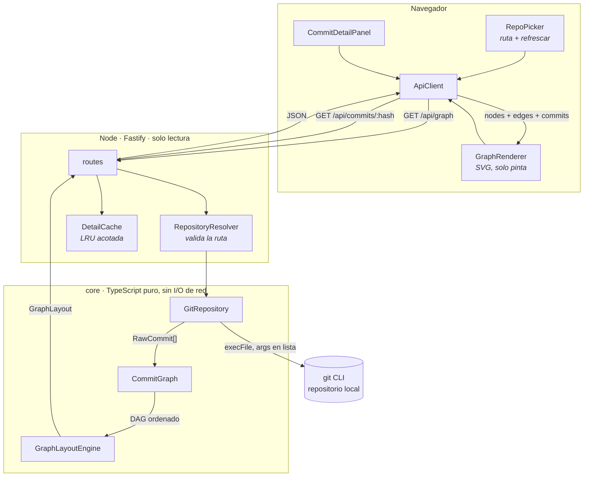
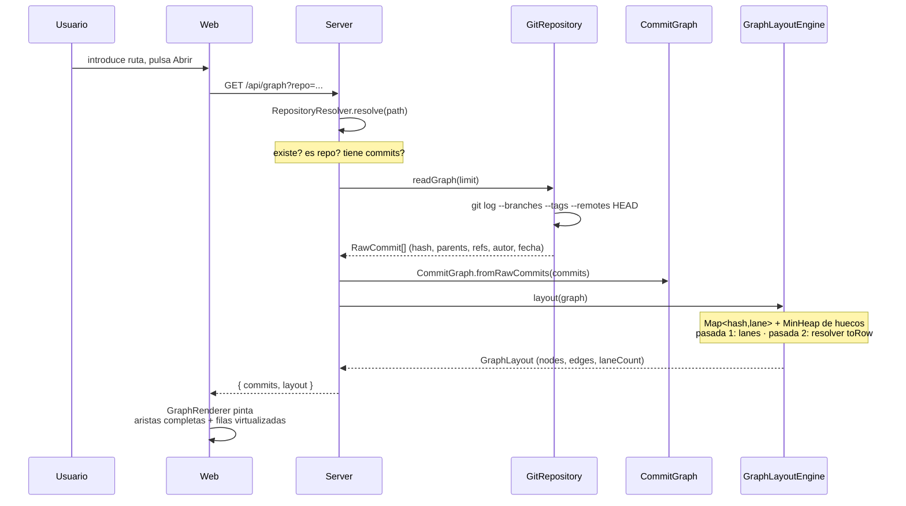

# GitTree MVP — Design

**Feature slug:** `gittree-mvp`
**Requisitos:** `specs/gittree-mvp/requirements.md`
**Decisiones base:** `INFORME-FASE-1.md`
**Raíz del proyecto:** la raiz de este repositorio

---

## 1. Arquitectura

Backend Node fino + React en el navegador. El núcleo (`core`) no conoce HTTP ni React: es TypeScript puro, y por eso el `GraphLayoutEngine` se puede testear aislado (Requirement 3.4).



### Flujo de carga



---

## 2. Modelo de datos

Contratos compartidos entre server y web. Viven en `packages/core/src/types.ts` y el paquete `web` los importa: una sola definición, sin duplicar tipos a ambos lados.

```ts
// --- Lo que sale de git, sin interpretar ---

// Autor o committer de un commit
export interface Person {
  readonly name: string;
  readonly email: string;
}

// Clasificacion de una ref segun el formato que emite %D
export type RefKind = "local" | "remote" | "tag" | "head";

// Una ref apuntando a un commit. isCheckedOut solo es true para la branch de HEAD
export interface Ref {
  readonly kind: RefKind;
  readonly name: string;
  readonly isCheckedOut: boolean;
}

// Un commit tal y como lo devuelve git log, ya parseado pero sin posicionar
export interface RawCommit {
  readonly hash: string;
  readonly parents: readonly string[];
  readonly refs: readonly Ref[];
  readonly author: Person;
  readonly authoredAt: string;
  readonly subject: string;
}

// --- Lo que produce el layout ---

// Un commit ya posicionado en la rejilla del grafo
export interface CommitNode {
  readonly hash: string;
  readonly row: number;
  readonly lane: number;
  readonly colorIndex: number;
}

// Como se conecta un commit con uno de sus padres.
// toRow es null cuando el padre no esta en el conjunto cargado (clon shallow
// o limite alcanzado): la arista se dibuja saliendo por abajo, sin destino
export type EdgeKind = "straight" | "branch" | "merge";

export interface LaneEdge {
  readonly fromRow: number;
  readonly fromLane: number;
  readonly toRow: number | null;
  readonly toLane: number;
  readonly colorIndex: number;
  readonly kind: EdgeKind;
}

// Resultado completo del engine: puro, serializable, comparable en un test
export interface GraphLayout {
  readonly nodes: readonly CommitNode[];
  readonly edges: readonly LaneEdge[];
  readonly laneCount: number;
  readonly rowCount: number;
}

// --- Detalle bajo demanda ---

export type ChangeStatus =
  | "added" | "modified" | "deleted"
  | "renamed" | "copied" | "typeChanged";

// Un archivo tocado por un commit. previousPath solo existe en rename y copy
export interface ChangedFile {
  readonly status: ChangeStatus;
  readonly path: string;
  readonly previousPath?: string;
}

export interface CommitDetail {
  readonly hash: string;
  readonly parents: readonly string[];
  readonly author: Person;
  readonly authoredAt: string;
  readonly committer: Person;
  readonly committedAt: string;
  readonly subject: string;
  readonly body: string;
  readonly isMerge: boolean;
  readonly files: readonly ChangedFile[];
}
```

### Cómo se llenan estos tipos desde git

Dos comandos, ambos con los argumentos pasados como lista (Requirement 8.3):

```ts
// Separadores: NUL entre registros (-z), US (\x1f) entre campos.
// Ninguno de los dos puede aparecer dentro de un mensaje de commit
const GRAPH_FORMAT = "%H%x1f%P%x1f%D%x1f%an%x1f%ae%x1f%aI%x1f%s";

// --branches --tags --remotes HEAD en lugar de --all: --all arrastra refs/stash,
// que mete commits que no pertenecen al historial (medido: 2 en repo-ref)
const GRAPH_ARGS = [
  "log", "--branches", "--tags", "--remotes", "HEAD",
  "--topo-order", "-z", `--pretty=format:${GRAPH_FORMAT}`,
  `--max-count=${limit}`,
];

// --first-parent -m es obligatorio: sin ellos git suprime el diff de los merges
// y --name-status devuelve cero lineas (Requirement 5.2)
const DETAIL_ARGS = [
  "show", hash, "--name-status", "--first-parent", "-m",
  "--find-renames", "-z", `--pretty=format:${DETAIL_FORMAT}`,
];
```

Parseo de `%D` según los formatos confirmados en repos reales:

| Cadena en `%D` | Se convierte en |
|---|---|
| `HEAD -> main` | `{ kind: "local", name: "main", isCheckedOut: true }` |
| `main` | `{ kind: "local", name: "main", isCheckedOut: false }` |
| `origin/main` | `{ kind: "remote", name: "origin/main", isCheckedOut: false }` |
| `tag: v1.0` | `{ kind: "tag", name: "v1.0", isCheckedOut: false }` |
| `HEAD` (solo) | `{ kind: "head", name: "HEAD", isCheckedOut: false }` — detached |
| `origin/HEAD` | se descarta: es un alias, no una posición propia |

---

## 3. Componentes

Una responsabilidad por clase. Las cuatro del enunciado, más tres piezas de apoyo.

| Componente | Archivo | Responsabilidad | Depende de |
|---|---|---|---|
| `GitRepository` | `packages/core/src/GitRepository.ts` | Leer el repo y devolver datos tipados | `simple-git` |
| `CommitGraph` | `packages/core/src/CommitGraph.ts` | Modelo puro del DAG | — |
| `GraphLayoutEngine` | `packages/core/src/GraphLayoutEngine.ts` | Posiciones de nodos y aristas | `MinHeap` |
| `GraphRenderer` | `packages/web/src/GraphRenderer.tsx` | Pintar el layout en SVG | React |
| `MinHeap` | `packages/core/src/MinHeap.ts` | Hueco libre más a la izquierda | — |
| `RepositoryResolver` | `packages/server/src/RepositoryResolver.ts` | Validar la ruta antes de tocar git | — |
| `DetailCache` | `packages/server/src/DetailCache.ts` | LRU de detalles por hash | — |

### 3.1 `GitRepository`

Única pieza que habla con git. No sabe nada de lanes, colores ni HTTP.

```ts
export class GitRepository {
  // La ruta ya viene validada por RepositoryResolver
  constructor(private readonly repoPath: string) {}

  // Historial completo en orden topologico, con padres y refs resueltos
  async readGraph(limit: number): Promise<readonly RawCommit[]>;

  // Detalle de un commit concreto, incluidos los archivos de un merge
  async readCommitDetail(hash: string): Promise<CommitDetail>;
}
```

Usa `simple-git` a través de `.raw()`, porque su `.log()` tipado no expone `%P` ni `%D`. Lo que aporta la librería es el spawn seguro, la cola de comandos y la normalización de errores; el formato lo controlamos nosotros. Al quedar toda la lectura detrás de esta clase, cambiar a `execFile` directo sería sustituir un archivo.

### 3.2 `CommitGraph`

Modelo del DAG, sin dependencias de render ni de git. Conserva el orden topológico que ya trae `git log` — no lo recalcula (Requirement 2.1).

```ts
export class CommitGraph {
  // Construye el indice hash -> commit conservando el orden recibido
  static fromRawCommits(commits: readonly RawCommit[]): CommitGraph;

  // Commits en orden topologico: el orden de las filas del grafo
  get commits(): readonly RawCommit[];

  get(hash: string): RawCommit | undefined;

  // true si el padre no esta en el conjunto cargado (shallow o limite)
  isDangling(parentHash: string): boolean;
}
```

### 3.3 `GraphLayoutEngine`

Aquí vive la complejidad. Función pura `CommitGraph → GraphLayout`: mismos commits, mismo resultado, siempre (Requirement 3.4). Es la variante indexada validada en la Fase 1 — `Map` para el lookup de lanes y `MinHeap` para los huecos, no `indexOf`, que degrada a O(N²).

```ts
export class GraphLayoutEngine {
  constructor(private readonly palette: readonly string[] = DEFAULT_PALETTE) {}

  // Dos pasadas: la primera asigna lanes, la segunda resuelve el toRow de
  // cada arista, que no se conoce hasta haber visto al padre
  layout(graph: CommitGraph): GraphLayout;
}
```

**Pasada 1 — asignación de lanes.** Por cada commit, en orden:

1. Se busca en `waiting: Map<hash, lane | lane[]>` quién esperaba a este commit. Lookup O(1), no escaneo.
2. Si nadie lo esperaba, es punta de rama: toma el hueco libre más a la izquierda del `MinHeap`, o abre un lane nuevo a la derecha (Requirement 3.3).
3. Si lo esperaban varios lanes (convergencia), gana el de índice menor; los demás emiten su arista de entrada y se liberan al heap (Requirement 3.2).
4. El primer padre **hereda** el lane, así que la rama sigue recta. Cada padre adicional reserva su propio lane y emite una arista `merge` (Requirement 2.3).
5. Un commit sin padres libera su lane (Requirement 2.4).

**Pasada 2 — resolución de aristas.** Las aristas se emiten con el hash del padre; un `map` final las convierte en `toRow`/`toLane` consultando el índice de nodos. Un padre ausente deja `toRow: null` y se pinta como cabo suelto hacia abajo, sin romper nada.

El color se deriva del índice de lane en el momento de abrirlo, y se recicla con él: `colorIndex = lane % palette.length` (Requirement 3.6).

### 3.4 `GraphRenderer`

Solo pinta lo que el engine calculó. No decide posiciones.

```tsx
interface GraphRendererProps {
  readonly layout: GraphLayout;
  readonly commits: readonly RawCommit[];
  readonly selectedHash: string | null;
  readonly onSelect: (hash: string) => void;
}
```

Estrategia de render, corregida en la evaluación de Fase 1:

- **Aristas: se pintan todas, sin virtualizar.** Su número lo fija la cantidad de ramas históricas, no `N` (medido: 34 tramos en un repo de 112 commits, 249 en uno de 50k). Virtualizarlas haría desaparecer las que atraviesan la ventana sin empezar ni terminar en ella (Requirement 2.6).
- **Filas: virtualizadas.** Solo se montan las visibles más un margen de sobre-render.
- **Altura de fila fija** (`ROW_HEIGHT`), lo que hace que localizar la primera fila visible sea `Math.floor(scrollTop / ROW_HEIGHT)` — O(1), sin búsqueda binaria sobre sumas prefijas. A cambio, ninguna fila puede expandirse dentro del grafo.

Presupuesto de elementos: `tramos + filasVisibles × ~6`, unos 500–730 en la práctica, muy por debajo del umbral de degradación de SVG (~3.000–5.000).

Geometría en `packages/web/src/geometry.ts`:

```ts
// Constantes de la rejilla. Fijas por diseño: hacen el indexado O(1)
export const ROW_HEIGHT = 26;
export const LANE_WIDTH = 14;
export const NODE_RADIUS = 4;
export const OVERSCAN_ROWS = 10;

// Centro de un nodo a partir de su fila y su lane
export const centerOf = (row: number, lane: number) => ({
  x: LANE_WIDTH * (lane + 1),
  y: ROW_HEIGHT * row + ROW_HEIGHT / 2,
});
```

Trazado de una arista: si `fromLane === toLane` es un segmento recto. Si difieren, la línea **se mantiene en el lane de origen hasta la fila de destino y dobla al final**, que es el `lockedFirst` de Git Graph; así los merges entran limpios sin cruzar lanes activos (Requirement 3.5).

### 3.5 Piezas de apoyo

`RepositoryResolver` traduce cada fallo posible a un error tipado, para que la UI pueda dar el mensaje concreto que pide el Requirement 1:

```ts
export type RepoError =
  | "NOT_FOUND" | "NOT_A_REPO" | "EMPTY_REPO" | "GIT_MISSING";

export class RepositoryResolver {
  // Normaliza separadores, comprueba existencia y ejecuta rev-parse --git-dir
  async resolve(rawPath: string): Promise<GitRepository>;
}
```

`DetailCache` es una LRU acotada sobre `${repoPath}:${hash}`. El detalle de un commit es inmutable, así que cachearlo es seguro y cubre el Requirement 5.6. `Map` en JS conserva el orden de inserción, lo que permite una LRU sencilla sin lista doblemente enlazada: en un `get` que acierta se borra y se vuelve a insertar la clave, y al desalojar se toma la primera clave del iterador. Es O(1) amortizado y bastan ~30 líneas.

---

## 4. API HTTP

Dos endpoints, ambos `GET`, ambos de solo lectura (Requirement 8).

| Endpoint | Query | Respuesta |
|---|---|---|
| `GET /api/graph` | `repo` (obligatorio), `limit` (opcional, por defecto 10000, máximo 50000) | `GraphResponse` |
| `GET /api/commits/:hash` | `repo` (obligatorio) | `CommitDetail` |

```ts
export interface GraphResponse {
  readonly repoPath: string;
  readonly commits: readonly RawCommit[];
  readonly layout: GraphLayout;
  // true si se alcanzo el limite: el historial esta truncado
  readonly truncated: boolean;
}

// Errores como JSON, nunca como excepcion sin forma
export interface ApiError {
  readonly code: RepoError | "BAD_REQUEST" | "COMMIT_NOT_FOUND";
  readonly message: string;
}
```

`commits[i]` y `layout.nodes[i]` describen el mismo commit: van alineados por índice, así que el cliente no necesita un join por hash para pintar una fila.

---

## 5. Estructura de archivos

pnpm workspaces: tres paquetes, un solo `pnpm install`, y el núcleo testeable sin levantar nada.

```
git-ui/
├── package.json                      # workspaces + scripts de arranque
├── INFORME-FASE-1.md
├── README.md                         # comandos para Windows y Linux
├── specs/gittree-mvp/
└── packages/
    ├── core/
    │   ├── src/
    │   │   ├── types.ts              # contratos compartidos
    │   │   ├── GitRepository.ts
    │   │   ├── CommitGraph.ts
    │   │   ├── GraphLayoutEngine.ts
    │   │   ├── MinHeap.ts
    │   │   └── refs.ts               # parseo de %D
    │   └── test/
    │       └── GraphLayoutEngine.test.ts
    ├── server/
    │   └── src/
    │       ├── index.ts              # Fastify + registro de rutas
    │       ├── routes.ts
    │       ├── RepositoryResolver.ts
    │       └── DetailCache.ts
    └── web/
        ├── index.html
        ├── vite.config.ts            # proxy /api -> localhost:5175
        └── src/
            ├── main.tsx
            ├── App.tsx               # estado: repo, layout, seleccion
            ├── ApiClient.ts
            ├── RepoPicker.tsx
            ├── GraphRenderer.tsx
            ├── RefBadge.tsx
            ├── CommitDetailPanel.tsx
            ├── useVirtualRows.ts
            └── geometry.ts
```

---

## 6. Testing del `GraphLayoutEngine`

El engine es una función pura, así que se testea sin git, sin servidor y sin DOM: se le pasa un `RawCommit[]` escrito a mano y se comprueban lanes y filas.

DAG de referencia — dos ramas y un merge, el mínimo que pide el criterio de aceptación:

```
row 0  M   merge         parents: F, B
row 1  |\
row 2  | F  feature      parents: A
row 3  B |  main         parents: A
row 4  |/
row 5  A   base          parents: (raiz)
```

Los dos tests:

1. **Lanes y filas.** `A` y `B` comparten lane 0 (el primer padre hereda el lane); `F` ocupa el lane 1; `M` vuelve al lane 0. Verifica los puntos 3.1, 3.2 y 3.3.
2. **Aristas de merge.** `M` emite exactamente dos aristas, una a cada padre, y la que va a `F` cambia de lane mientras la que va a `B` no. Verifica los puntos 2.3 y 3.5.

Un tercero, barato y valioso: **determinismo** — ejecutar `layout()` dos veces sobre la misma entrada y comparar el resultado serializado (Requirement 3.4).

---

## 7. Trade-offs

**Índice `Map` + heap en vez de escaneo lineal.** Cuesta un +30% con pocos lanes (2,0 → 2,9 ms, invisible) y elimina un cliff de 6 segundos en repos con muchas ramas colgando de una base común. Se descartó una versión adaptativa: dos rutas de código que pueden divergir para ahorrar 1 ms.

**El grafo entero en una respuesta.** A ~250 bytes por commit, 10.000 commits son unos 2,5 MB de JSON. Es aceptable en localhost y evita toda la complejidad de paginar un grafo, donde una página no basta para dibujar aristas que la cruzan. Por eso existe `limit` y por eso la respuesta trae `truncated`: si algún día molesta, el punto de cambio ya está marcado.

**pnpm workspaces en vez de un paquete único.** Tres `package.json` en lugar de uno, a cambio de que `core` no arrastre React ni Fastify y sus tests corran en milisegundos.

**Altura de fila fija.** Compra el indexado O(1) del scroll. El precio es que ninguna fila puede expandirse en el grafo; el detalle del commit va en un panel lateral, no inline.

**`simple-git` usado casi solo por `.raw()`.** Es una dependencia cuyo valor real es el manejo de procesos, no su API tipada. Se asume conscientemente, y `GitRepository` la aísla.
