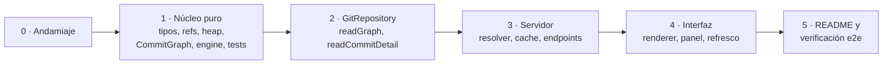

# GitTree MVP — Tasks

**Feature slug:** `gittree-mvp`
**Requisitos:** `specs/gittree-mvp/requirements.md` · **Design:** `specs/gittree-mvp/design.md`

Orden por dependencia: cada bloque solo necesita lo anterior. El núcleo se completa y se testea **antes** de que exista servidor o UI, para que el `GraphLayoutEngine` quede validado contra un DAG de ejemplo sin nada más montado.

Convenciones que aplican a todas las tareas: código en inglés, comentarios en español en la línea anterior, estilo funcional (`map` / `filter` / `reduce`), TypeScript estricto.

---

## Bloque 0 — Andamiaje

- [x] **0.1 · Crear el workspace y la configuración de TypeScript**
  Inicializar `package.json` raíz con pnpm workspaces (`packages/*`), los tres `package.json` de `core`, `server` y `web`, y un `tsconfig.base.json` con `strict: true`, `noUncheckedIndexedAccess: true` y `exactOptionalPropertyTypes: true`. Añadir `vitest` en la raíz y `concurrently` para el arranque conjunto.
  *Requisitos:* 7.1, 7.3 · *Design:* §5 · *Prerrequisitos:* ninguno
  **Verificación:** `pnpm install` termina sin compilar nada nativo, y `pnpm typecheck` pasa en los tres paquetes.
  **Resultado:** hecho. La CI pasa en Ubuntu y Windows con Node 22 y 24. `engines` quedó en `>=22.13`, no en 20: pnpm 11 lo exige.

---

## Bloque 1 — Núcleo puro (sin git, sin red, sin DOM)

- [x] **1.1 · Definir los contratos compartidos**
  Escribir `packages/core/src/types.ts` con `Person`, `Ref`, `RefKind`, `RawCommit`, `CommitNode`, `LaneEdge`, `EdgeKind`, `GraphLayout`, `ChangeStatus`, `ChangedFile`, `CommitDetail`, `GraphResponse` y `ApiError`. Todo `readonly`. Exportarlos desde el índice del paquete para que `server` y `web` los importen sin duplicar.
  *Requisitos:* base de todos · *Design:* §2 · *Prerrequisitos:* 0.1
  **Verificación:** `tsc --noEmit` limpio; ningún tipo se define dos veces en el repo.

- [x] **1.2 · Implementar `MinHeap`**
  `packages/core/src/MinHeap.ts`: heap binario de enteros con `push`, `pop` y `size`, sin asignar objetos por entrada. Es lo que garantiza "el lane libre más a la izquierda" en O(log L).
  *Requisitos:* 3.3 · *Design:* §3.3 · *Prerrequisitos:* 0.1
  **Verificación:** test que inserta `[5,1,4,2]` y comprueba que sale `[1,2,4,5]`.

- [x] **1.3 · Implementar el parseo de refs**
  `packages/core/src/refs.ts`: función pura que convierte la cadena de `%D` en `Ref[]`, cubriendo los seis casos de la tabla del design (`HEAD -> x`, nombre pelado, `origin/x`, `tag: x`, `HEAD` solo, y el descarte de `origin/HEAD`). Una cadena vacía devuelve lista vacía.
  *Requisitos:* 4.2, 4.3, 4.4 · *Design:* §2 · *Prerrequisitos:* 1.1
  **Verificación:** test con las cadenas reales tomadas de `repo-ref`, incluida `HEAD -> refs/heads/feature/ui-polish, refs/remotes/origin/feature/ui-polish`.
  **Resultado:** hecho con `--decorate=full`. Sin ese flag el parseo es ambiguo: `feature/x` (local) y `origin/x` (remota) llevan barra las dos.

- [x] **1.4 · Implementar `CommitGraph`**
  `packages/core/src/CommitGraph.ts`: `fromRawCommits` construye el índice `hash → RawCommit` conservando el orden recibido; `commits`, `get` e `isDangling`. Sin recalcular el orden topológico.
  *Requisitos:* 2.1 · *Design:* §3.2 · *Prerrequisitos:* 1.1
  **Verificación:** test que confirma que `commits` preserva el orden de entrada y que `isDangling` detecta un padre ausente.

- [x] **1.5 · Implementar la pasada 1 del `GraphLayoutEngine`: asignación de lanes**
  `packages/core/src/GraphLayoutEngine.ts`: recorrido único con `waiting: Map<hash, lane | lane[]>` y el `MinHeap` de huecos. Cubre los cinco pasos del design: punta de rama, convergencia, herencia del lane por el primer padre, reserva de lane por cada padre adicional, y liberación en la raíz. Las aristas se emiten con el **hash** del padre, todavía sin `toRow`.
  *Requisitos:* 2.2, 2.3, 2.4, 3.1, 3.2, 3.3, 3.6 · *Design:* §3.3 · *Prerrequisitos:* 1.2, 1.4
  **Verificación:** sobre el DAG de referencia del design, `A` y `B` caen en el lane 0, `F` en el lane 1 y `M` vuelve al lane 0.
  **Resultado:** correcto. Se corrigió el DAG del design: los padres del merge son `[B, F]`, no `[F, B]` — en git el primer padre de un merge es la rama sobre la que se fusiona.

- [x] **1.6 · Implementar la pasada 2: resolución de aristas**
  En el mismo archivo: un `map` final que convierte cada arista pendiente en `LaneEdge` resolviendo `toRow` y `toLane` contra el índice de nodos, y dejando `toRow: null` cuando el padre no está en el conjunto cargado. Clasificar cada arista como `straight`, `branch` o `merge`.
  *Requisitos:* 2.2, 2.3, 3.5 · *Design:* §3.3 · *Prerrequisitos:* 1.5
  **Verificación:** un DAG cuyo último commit referencia un padre inexistente produce una arista con `toRow: null` en lugar de lanzar.

- [x] **1.7 · Escribir los tests del `GraphLayoutEngine`**
  `packages/core/test/GraphLayoutEngine.test.ts` con los tres tests del design: (a) lanes y filas sobre el DAG de dos ramas y un merge, (b) el merge emite exactamente dos aristas y solo la que va a `feature` cambia de lane, (c) determinismo — dos ejecuciones sobre la misma entrada dan resultados idénticos al serializar.
  *Requisitos:* 3.4 y criterio de aceptación del enunciado · *Design:* §6 · *Prerrequisitos:* 1.6
  **Verificación:** `pnpm test` pasa en verde sin que exista aún servidor ni UI.

---

## Bloque 2 — Lectura del repositorio

- [x] **2.1 · Implementar `GitRepository.readGraph`**
  `packages/core/src/GitRepository.ts`: ejecutar `git log --branches --tags --remotes HEAD --topo-order -z --pretty=format:...` vía `simple-git.raw()`, con `--max-count`. Partir por `NUL`, luego por `\x1f`, y mapear a `RawCommit[]` usando `refs.ts`.
  *Requisitos:* 2.7, 8.1, 8.2, 8.3 · *Design:* §2, §3.1 · *Prerrequisitos:* 1.3, 1.1
  **Verificación:** contra `repo-ref` devuelve 110 commits (no 112: los 2 del stash quedan fuera), 1 raíz y **13** merges.
  **Resultado:** 110 / 1 / 13. El criterio decía 14 merges y era erróneo: el merge que falta es el propio commit de stash, que tiene 3 padres y por tanto contaba como merge bajo `--all`.

- [x] **2.2 · Implementar `GitRepository.readCommitDetail`**
  En la misma clase: `git show <hash> --name-status --first-parent -m --find-renames -z`, parseando cabecera y lista de archivos. Mapear los códigos de estado (`A`, `M`, `D`, `R###`, `C###`, `T`) a `ChangeStatus`, y rellenar `previousPath` en renames y copias.
  *Requisitos:* 5.1, 5.2, 5.3, 5.4 · *Design:* §2, §3.1 · *Prerrequisitos:* 1.1
  **Verificación:** sobre el merge `f04a748` de `repo-ref` devuelve 21 archivos, **no** una lista vacía.
  **Resultado:** 21 archivos, todos `modified`.

---

## Bloque 3 — Servidor

- [x] **3.1 · Implementar `RepositoryResolver`**
  `packages/server/src/RepositoryResolver.ts`: normalizar separadores `\` y `/`, comprobar existencia, ejecutar `git rev-parse --git-dir` y detectar repositorio sin commits y ausencia del binario `git`. Devolver un `GitRepository` listo o un `RepoError` tipado.
  *Requisitos:* 1.2, 1.3, 1.4, 1.5, 1.6, 7.2, 8.4 · *Design:* §3.5 · *Prerrequisitos:* 2.1
  **Verificación:** cada uno de los cuatro errores se reproduce a mano y devuelve su código, no una excepción genérica.

- [x] **3.2 · Implementar `DetailCache`**
  `packages/server/src/DetailCache.ts`: LRU acotada sobre `${repoPath}:${hash}` apoyada en el orden de inserción de `Map` — borrar y reinsertar en el acierto, desalojar la primera clave del iterador al llenarse.
  *Requisitos:* 5.6 · *Design:* §3.5 · *Prerrequisitos:* 0.1
  **Verificación:** test con capacidad 2 que confirma el desalojo del menos usado recientemente.

- [x] **3.3 · Montar Fastify y los dos endpoints**
  `packages/server/src/routes.ts` e `index.ts`: `GET /api/graph` (con `limit` por defecto 10000, máximo 50000, y `truncated` en la respuesta) y `GET /api/commits/:hash`. Encadenar resolver → `GitRepository` → `CommitGraph` → `GraphLayoutEngine`. Errores como `ApiError` JSON con el código HTTP adecuado.
  *Requisitos:* 1.1, 1.7, 5.1, 8.1, 8.2 · *Design:* §4 · *Prerrequisitos:* 1.7, 2.2, 3.1, 3.2
  **Verificación:** `curl` a `/api/graph` con la ruta de `repo-ref` devuelve `laneCount: 3` y 110 nodos.
  *El 5 del criterio original venía del benchmark con `--all`; `git log --graph` dibuja 3 columnas para este conjunto de refs, y el engine coincide.*

---

## Bloque 4 — Interfaz

- [x] **4.1 · Scaffold de Vite y `ApiClient`**
  `packages/web` con React y TypeScript, `vite.config.ts` con proxy de `/api` al puerto del backend, y `ApiClient.ts` tipado contra `GraphResponse`, `CommitDetail` y `ApiError`.
  *Requisitos:* 7.1, 7.4 · *Design:* §4, §5 · *Prerrequisitos:* 3.3
  **Verificación:** `pnpm dev` levanta backend y frontend con una sola orden, y el proxy responde.

- [x] **4.2 · Implementar la geometría y `useVirtualRows`**
  `geometry.ts` con `ROW_HEIGHT`, `LANE_WIDTH`, `NODE_RADIUS`, `OVERSCAN_ROWS` y `centerOf`. `useVirtualRows.ts`: hook que a partir de `scrollTop` y la altura del contenedor devuelve `[startRow, endRow]` con `Math.floor(scrollTop / ROW_HEIGHT)` — sin búsqueda binaria.
  *Requisitos:* 2.8 · *Design:* §3.4 · *Prerrequisitos:* 4.1
  **Verificación:** test del hook: con `ROW_HEIGHT` 26, `scrollTop` 260 y alto 520 devuelve el rango esperado con su overscan.

- [x] **4.3 · Implementar `GraphRenderer`**
  `GraphRenderer.tsx`: un `<path>` por arista **sin virtualizar**, y las filas virtualizadas según `useVirtualRows`. Aristas rectas cuando `fromLane === toLane`; si difieren, mantenerse en el lane de origen y doblar al llegar a la fila destino. `toRow: null` se dibuja como cabo suelto hacia abajo. Click en una fila dispara `onSelect`, y el commit seleccionado se resalta.
  *Requisitos:* 2.2, 2.3, 2.5, 2.6, 2.8, 3.5, 5.7 · *Design:* §3.4 · *Prerrequisitos:* 4.2
  **Verificación:** con `repo-ref` cargado, hacer scroll al centro y comprobar que las líneas que atraviesan la ventana siguen dibujadas.
  **Resultado:** medido en el DOM: `path` se mantiene en **122** en cualquier posición de scroll (las aristas nunca se virtualizan), mientras `circle` y `.row` pasan de 43 a 55 según la ventana. Total ~452 elementos.

- [x] **4.4 · Implementar `RefBadge`**
  `RefBadge.tsx`: una etiqueta por ref, con estilo distinto para local, remote, tag y head, marca visible en la branch con `isCheckedOut`, y truncado cuando no caben en el ancho disponible.
  *Requisitos:* 4.1, 4.2, 4.3, 4.4, 4.5 · *Design:* §3.4 · *Prerrequisitos:* 4.3
  **Verificación:** el commit `aefd801` de `repo-ref` muestra sus dos refs, la local marcada como activa.

- [x] **4.5 · Implementar `RepoPicker` y el estado de `App`**
  `App.tsx` con el estado de repo, layout, selección y error; `RepoPicker.tsx` con el campo de ruta y el botón de abrir. Mapear cada `RepoError` a su mensaje concreto y mostrar el estado de carga.
  *Requisitos:* 1.1, 1.2, 1.3, 1.4, 1.5, 1.6, 1.7 · *Design:* §3.5, §5 · *Prerrequisitos:* 4.3
  **Verificación:** las cuatro rutas inválidas producen sus cuatro mensajes distintos, y una válida pinta el grafo.
  **Resultado:** NOT_FOUND, NOT_A_REPO, EMPTY_REPO y BAD_REQUEST devuelven su código y su HTTP.

- [x] **4.6 · Implementar `CommitDetailPanel`**
  `CommitDetailPanel.tsx`: hash completo, autor, email, fecha, asunto y cuerpo, y la lista de archivos con su tipo de cambio; en renames, ruta anterior y nueva. Estado de carga propio, y error que no descarta el grafo ya pintado.
  *Requisitos:* 5.1, 5.2, 5.3, 5.4, 5.5, 5.8 · *Design:* §3.4, §4 · *Prerrequisitos:* 4.5
  **Verificación:** seleccionar el merge `f04a748` muestra sus 21 archivos; seleccionar otro commit reemplaza el contenido.
  **Resultado:** 21 archivos en pantalla, con la nota "frente al primer padre".

- [x] **4.7 · Implementar el refresco bajo demanda**
  Acción de refrescar en `App.tsx`: relee el grafo, conserva selección y scroll si el commit sigue existiendo, limpia la selección si desapareció, y ante un fallo mantiene el último grafo válido. Sin ningún refresco automático.
  *Requisitos:* 6.1, 6.2, 6.3, 6.4, 6.5 · *Design:* §3.4 · *Prerrequisitos:* 4.6
  **Verificación:** hacer un commit en la terminal, pulsar refrescar, y verlo aparecer conservando la posición de scroll.
  **Resultado:** el refresco conserva scroll (900px) y selección. Ante una ruta inválida el grafo anterior permanece en pantalla con el mensaje de error arriba.

---

## Bloque 5 — Cierre

- [ ] **5.1 · Escribir el README**
  `README.md` con la estructura del proyecto, los comandos de instalación y arranque para Windows (PowerShell y Git Bash) y para Linux, el requisito de tener `git` en el PATH, y cómo correr los tests.
  *Requisitos:* 7.1, 7.3 · *Prerrequisitos:* 4.7
  **Verificación:** seguir el README desde cero en una carpeta limpia levanta la aplicación.

- [ ] **5.2 · Verificación end-to-end contra un repositorio real**
  Recorrer los criterios de aceptación del enunciado con `<ruta-a-repo-ref>`: el grafo se ve legible con sus 2+ ramas y sus 14 merges, seleccionar un commit muestra su detalle real, y el refresco funciona.
  *Requisitos:* todos · *Prerrequisitos:* 5.1
  **Verificación:** captura del grafo renderizado y de un detalle de merge con archivos.

---

## Resumen de dependencias

El bloque 1 se completa y se testea sin que exista servidor ni UI: es lo que hace que el `GraphLayoutEngine` sea verificable de forma aislada.
